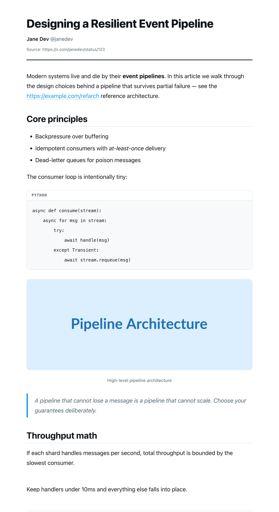

<div align="center">


# X Article Export — PDF & Markdown

**Turn X (Twitter) long-form Articles into clean, beautiful PDFs and Markdown — by rebuilding the real content, not screenshotting the page.**

[](https://github.com/everettjf/x-article-export-pdf/actions/workflows/ci.yml)
[](manifest.json)
[](LICENSE)
[](PRIVACY.md)

[**Website**](https://everettjf.github.io/x-article-export-pdf/) · [Install](#-install) · [How it works](#-how-it-works) · [FAQ](#-faq)

<br>



<sub>An X Article exported to PDF — real headings, code, figures and quotes, not a screenshot.</sub>

</div>

---

## Why this exists

Most "tweet to PDF" tools are built for **threads**: they screenshot the timeline, dragging in the sidebar, the faded body text, and broken pagination. Point them at an X **Article** (the long-form editor with headings, code blocks, diagrams, and math) and you get a 9-page mess.

X Article Export takes the opposite approach. It reads X's article DOM — the same Draft.js tree the page renders from — and **reconstructs the document**: headings, ordered/unordered lists, fenced code blocks (with language), block-quotes, images at full resolution, KaTeX math, and inline links & emphasis. The result is a self-contained, print-ready document that looks like it was *designed* to be a PDF.

## ✨ Features

- **Real content, not pixels** — walks the article's DOM and rebuilds clean semantic HTML.
- **PDF export** — opens a controlled, CSP-safe print page with typographic styling and smart page breaks (code blocks and figures never split across pages).
- **Markdown export** — GitHub-flavored Markdown with fenced code, lists, links, images, and `$…$` math recovered from KaTeX. Drops straight into a repo or Obsidian.
- **Keeps what matters** — preserves hyperlinks (resolving `t.co` to the visible URL), **bold**/*italic*, `inline code`, headings H1–H6, block-quotes, and image alt text.
- **Two reading styles** — *Modern* (system sans) or *Serif*, plus A4 / Letter page sizes.
- **Original-resolution images** — rewrites media URLs to `name=orig`.
- **Thread fallback** — not an article? It still exports the tweet/thread as clean text.
- **100% local & private** — no servers, no analytics, no network calls except loading the page's own images and (optionally) KaTeX styles. See [PRIVACY.md](PRIVACY.md).
- **Zero build step** — plain, readable JavaScript. Clone and load.

## 🚀 Install

> Not yet on the Chrome Web Store — load it unpacked (takes ~30 seconds).

1. **Download** this repo — `git clone https://github.com/everettjf/x-article-export-pdf.git` or [grab the ZIP](https://github.com/everettjf/x-article-export-pdf/archive/refs/heads/main.zip) and unzip it.
2. Open `chrome://extensions` in Chrome (or any Chromium browser: Edge, Brave, Arc…).
3. Toggle **Developer mode** on (top-right).
4. Click **Load unpacked** and select the project folder.
5. Pin the **X Article Export** icon to your toolbar.

## 📄 Usage

1. Open an X Article — e.g. an `https://x.com/i/articles/…` page, or a `status` link that renders in article mode.
2. Click the extension icon.
3. Pick your **style** (Modern / Serif), **page size**, and whether to include the source link.
4. **Save as PDF** → a clean print dialog opens; choose *Save as PDF*.
   **Markdown** → a `.md` file downloads instantly.

If the icon says *Thread* instead of *Article*, you're on a regular tweet — it'll still export, just as plain text.

## 🛠 How it works

```
 X Article page
      │
      ▼
┌──────────────┐   detect()      ┌─────────────────────────┐
│  detector.js │ ──────────────► │ article / thread / none  │
└──────────────┘                 └─────────────────────────┘
      │ container
      ▼
┌──────────────┐   extract()     segments: heading · text · list ·
│ extractor.js │ ──────────────► code · quote · image · math · sep
└──────────────┘                       │
      │  (sanitize.js keeps links & emphasis, drops Draft.js junk)
      ▼
┌──────────────┐                 ┌──────────────┐
│ renderer.js  │ ──► PDF page    │ markdown.js  │ ──► .md download
└──────────────┘                 └──────────────┘
```

The PDF path renders into a **packaged extension page** rather than injecting into x.com. That sidesteps X's Content-Security-Policy (which can otherwise strip the inline styles that make the output look good) and gives us full control over pagination.

Selectors live in one place (`src/content/detector.js` + `extractor.js`) so an X redesign is a small, well-tested patch.

## 🧪 Development

```bash
npm install      # installs jsdom for the test suite
npm test         # runs the extraction pipeline against a synthetic X article DOM
npm run lint     # syntax-checks every source file
```

The tests in [`test/extension.test.js`](test/extension.test.js) load the real content scripts into jsdom and assert structure, escaping, link resolution, list grouping, code fidelity, Markdown output, and the thread fallback.

Project layout:

```
manifest.json              MV3 manifest
src/content/               injected modules (namespace, sanitize, detector,
                           extractor, renderer, markdown, main)
src/popup/                 toolbar popup UI
src/print/                 CSP-safe print page
src/background/            service worker
docs/                      GitHub Pages website
test/                      jsdom test suite
```

## ❓ FAQ

**Does it upload my data anywhere?**
No. Everything runs in your browser. The only network requests are for the article's own images and an optional KaTeX stylesheet (for math). [Details](PRIVACY.md).

**The button says "Thread", not "Article".**
You're on a normal tweet/thread page, not the long-form article view. Try the article's `/i/articles/…` link. Thread pages still export as clean text.

**Math/code looks off.**
Open an issue with the article URL. Code uses the exact text X renders; math is reconstructed from KaTeX. X changes its DOM occasionally — selectors are isolated for quick fixes.

**Why not just screenshot?**
Screenshots can't reflow to a page, can't be searched or copied, bloat the file, and drag in UI chrome. Reconstruction gives you a real document.

## 🤝 Contributing

Issues and PRs welcome — see [CONTRIBUTING.md](CONTRIBUTING.md). Good first contributions: new selector fallbacks when X ships a redesign, extra export themes, or EPUB output.

## 📜 License

[MIT](LICENSE) © everettjf. Not affiliated with X Corp. "X" and "Twitter" are trademarks of their respective owners.
